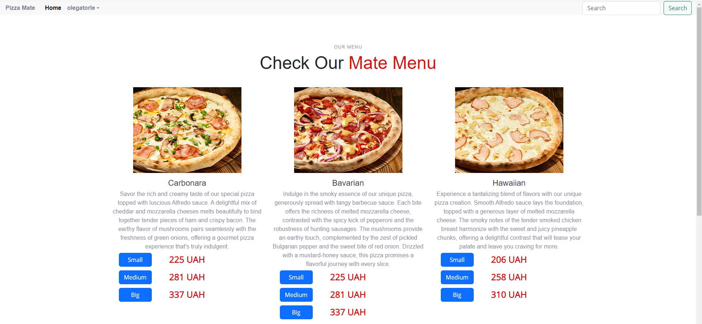

# PizzaMate - Django Pizza Ordering System 🍕

PizzaMate is a web application built with Django, allowing users to browse, customize, and order pizzas. Whether you want a Margherita or a completely custom pizza, PizzaMate has got you covered!



## Check it out!

link to render soon...

## Features

- **User Authentication**: Sign up, log in, and manage your profile.
- **Browse Pizzas**: View our collection of pizzas and choose the one you like.
- **Customize Pizzas**: Add or remove ingredients as per your preference.
- **Order Management**: Track your orders and view order history.
- **Admin Panel**: A custom admin panel for managing pizzas, ingredients, and orders.

## Getting Started

### Prerequisites

- Python (>= 3.7)
- Django (>= 4.2.5)
- PostgreSQL (or your choice of database)

### Installation

1. **Clone the Repository**:

```shell
git clone https://github.com/OlegatorLE/pizza-mate
cd pizza-mate
python -m venv venv
source venv/bin/activate  # On Windows use `venv\Scripts\activate`
pip install -r requirements.txt
Update the DATABASES setting in settings.py with your database configurations.
python manage.py migrate
python manage.py runserver
```
